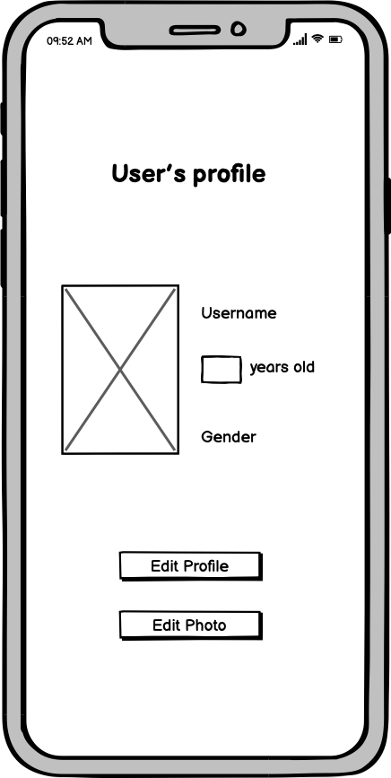

# Weight Controller

## Introduction

This app helps users to control or reduce their body weight by restricting daily calorie intake. New registered users will need to create a profile by providing: 
- Age 
- Gender
- Weight
- Height
- Life style

Once profile is created, appropriate daily calorie intake target will be set. The user then needs to record the food consumption, the app will calculate the calorie of the food and provide the remaining calorie for the day. Once the target is hit, app will alert the user to stop any further consumption for the rest of the day.

## Extension

Following features are intended in the future releases:
- Target on losing weight
- Calculate calorie for an uploaded picture(food)
- Burning calorie by activity tracker

## Installation Guides

- First clone down the repo
- Create a new virtual environment and activate it
- install all the packages necessary which is listed in the requirements file 
- At last, run the app 

## Wireframes

### Landing Page

### Signup Page

 

### Login Page

 

### Dashboard Page

 

### Profile Page

 

### Blog Page

 

